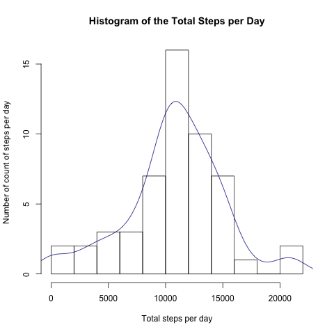
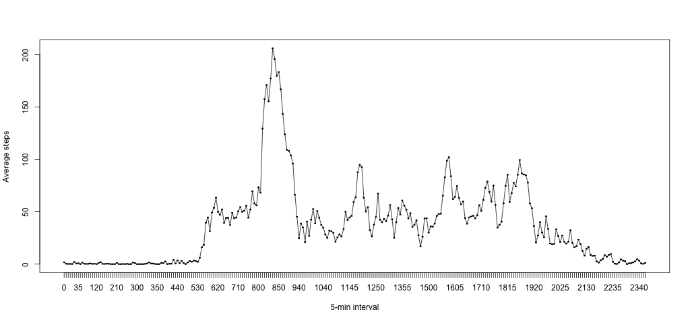
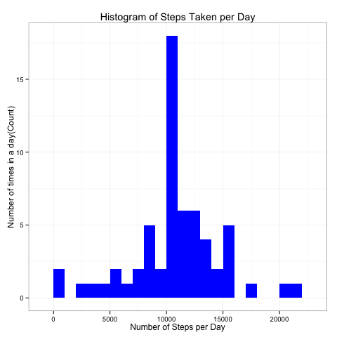
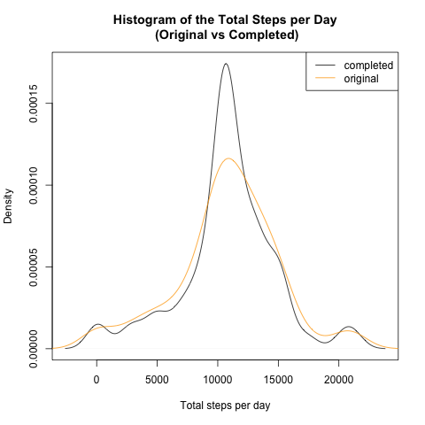
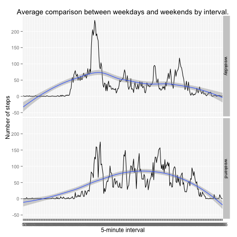

> Repository at [github.](https://github.com/3manuek/RepData_PeerAssessment1)


## Loading and preprocessing the data

First, we load all the necessary libraries and set the necessary variables to configure the current report:


> All the images generated by this report are stored in figure/. 


Loading the data, casts and filtering. The `act` table will contain the necessary data for the analysis.


```r
act <- read.csv("activity.csv",
                colClasses=c("numeric", "character", "numeric"))
colnames(act) <- c("steps","date","interval")
act$date <- as.Date(act$date, format = "%Y-%m-%d")
act$interval <- as.factor(act$interval)
```

Structure of the data frame `act`:


```r
colnames(act)
```

```
## [1] "steps"    "date"     "interval"
```


## What is mean total number of steps taken per day?


For this part of the assignment, you can ignore the missing values in the dataset.

- Calculate the total number of steps taken per day
- Make a histogram of the total number of steps taken each day
- Calculate and report the mean and median of the total number of steps taken per day


Calculating the Total steps per day:


```r
steps_by_day <- aggregate(steps ~  date , act, FUN = sum, na.rm = T)
colnames(steps_by_day) <- c("date","steps")
```

### Histogram of the total steps per day


```r
png1 = paste(fig_folder, "plot1.png", sep  = "")
png(png1)
thehist <- hist(steps_by_day$steps, breaks = 10)
multiplier <- thehist$counts / thehist$density
thedensity <- density(steps_by_day$steps)
thedensity$y <- thedensity$y * multiplier[1]

plot(thehist,main = "Histogram of the Total Steps per Day",
     xlab = "Total steps per day",
     ylab = "Number of count of steps per day")
lines(thedensity, col = "darkblue")
dev.off()
```

```
## RStudioGD 
##         2
```





Mean and Median calculation:


```r
tsm1 <- as.integer(mean(steps_by_day$steps, na.rm=TRUE))
tsm2 <- as.integer(median(steps_by_day$steps, na.rm=TRUE))
```

The average steps by day is **10766** and the median is **10765**.


## What is the average daily activity pattern?

Task:

- Make a time series plot (i.e. type = "l") of the 5-minute interval (x-axis) and the average number of steps taken, averaged across all days (y-axis)
- Which 5-minute interval, on average across all the days in the dataset, contains the maximum number of steps?


Time series plot of the 5-minute interval (x-axis) and the average number of steps taken, averaged across all days (y-axis).


```r
png2 = paste(fig_folder, "plot2.png", sep  = "")
png(png2, width = 1024, height = 480)
steps_by_interval = aggregate(act$steps,
                              by = list(act$interval),
                              FUN = mean, na.rm = T )
colnames(steps_by_interval) <- c("interval","steps")
plot(steps_by_interval$interval, steps_by_interval$steps, 
     type = "l",
     xlab = "5-min interval", ylab = "Average steps")
lines(steps_by_interval$interval, steps_by_interval$steps)
dev.off()
max_int <- steps_by_interval[which.max(steps_by_interval$steps),]
```

 

```
## RStudioGD 
##         2
```




> The max average of steps is **206** in the **835th** interval.


## Imputing missing values

### Task details

Note that there are a number of days/intervals where there are missing values (coded as NA). The presence of missing days may introduce bias into some calculations or summaries of the data.

- Calculate and report the total number of missing values in the dataset
- Devise a strategy for filling in all of the missing values in the dataset. The strategy does not need to be sophisticated. For example, you could use the mean/median for that day, or the mean for that 5-minute interval, etc.
- Create a new dataset that is equal to the original dataset but with the missing data filled in.
- Make a histogram of the total number of steps taken each day and Calculate and report the mean and median total number of steps taken per day. Do these values differ from the estimates from the first part of the assignment? What is the impact of imputing missing data on the estimates of the total daily number of steps?

### Worklog 

Missing values: **2304**

There are certainly better ways to fill up values without using dplyr. I'd choosen the mean over the median (which should be better), however there is no significant difference between each other. I added a floor rounding of the average in order to avoid non-integer steps values. 


```r
gg <- group_by(act, interval) %>%
      summarize(mean_step = mean(steps, na.rm = TRUE))

filldata <- function(p_value, p_interval){
      if (is.na(p_value))
            c(round(gg[gg$interval == p_interval,gg$mean_step][[2]]))
      else
            c(p_value)
}

act$filled <- mapply(filldata, act$steps, act$interval)
```


Using the manipulated data frame with completed cases, we obtain the following histogram:


```r
comp_agg <- act %>% 
      group_by(date) %>%
      summarize(count_steps = sum(filled))

png3 = paste(fig_folder, "plot3.png", sep  = "")
png(png3)
ggplot(comp_agg, aes(x = count_steps)) +
       geom_histogram(fill = "blue", binwidth = 1000) + 
        labs(title="Histogram of Steps Taken per Day", 
             x = "Number of Steps per Day", y = "Number of times in a day(Count)") + theme_bw() 
dev.off()
```

```
## RStudioGD 
##         2
```




Comparing density over the original set and the completed set to see the impact on the filling methodology:


```r
png4 = paste(fig_folder, "plot4.png", sep  = "")
png(png4)
plot(density(comp_agg$count_steps),
     main = "Histogram of the Total Steps per Day\n (Original vs Completed)",
     xlab = "Total steps per day",
     ylab = "Density")
lines(density(steps_by_day$steps), col = "orange")
legend("topright",legend = c("completed","original"),col = c("black","orange"), lty=c(1,1))
dev.off()
```

```
## RStudioGD 
##         2
```




```r
mea <- mean(comp_agg$count_steps)
med <- median(comp_agg$count_steps)
```

The mean of the total steps by date is 1.0765639 &times; 10<sup>4</sup> and the 1.0762 &times; 10<sup>4</sup>is `r med`.


## Are there differences in activity patterns between weekdays and weekends?

### Task details

For this part the weekdays() function may be of some help here. Use the dataset with the filled-in missing values for this part.

- Create a new factor variable in the dataset with two levels <U+2013> <U+201C>weekday<U+201D> and <U+201C>weekend<U+201D> indicating whether a given date is a weekday or weekend day.
- Make a panel plot containing a time series plot (i.e. type = "l") of the 5-minute interval (x-axis) and the average number of steps taken, averaged across all weekday days or weekend days (y-axis). See the README file in the GitHub repository to see an example of what this plot should look like using simulated data.
    
### Worklog


```r
splitweek <- function(date) {
    day <- weekdays(date)
    if (day %in% c("Monday", "Tuesday", "Wednesday", "Thursday", "Friday"))
        return("weekday")
    else if (day %in% c("Saturday", "Sunday"))
        return("weekend")
    else
        stop("ERROR: invalid date.")
}
act$day <- sapply(act$date, FUN=splitweek)
```

Now, let's make a panel plot containing plots of average number of steps taken on weekdays and weekends.


```r
averages <- aggregate(steps ~ interval + day, data=act, mean)
png5 = paste(fig_folder, "plot5.png", sep  = "")
png(png5, width = 1024, height = 480)
ggplot(averages, aes(interval, steps,group= day)) + 
      geom_line(color="darkblue") + facet_grid(day ~ .) +
      xlab("5-minute interval") + ylab("Number of steps") + 
      labs(title="Average comparison between weekdays and weekends by interval.") + 
      geom_smooth(method = "loess")
dev.off()
```

```
## RStudioGD 
##         2
```
    


Hypothesis:

We can see that the average activity during the weekends has a different pattern, showing more activity in later intervals. Weekdays activities could be more related to work duties. In other hand, weekend activities could lead to spare time and more out-of-home activities.

The spike during the first intervals of the day could be telling us that the subject in the study likes footing early in the weekdays before the office.
